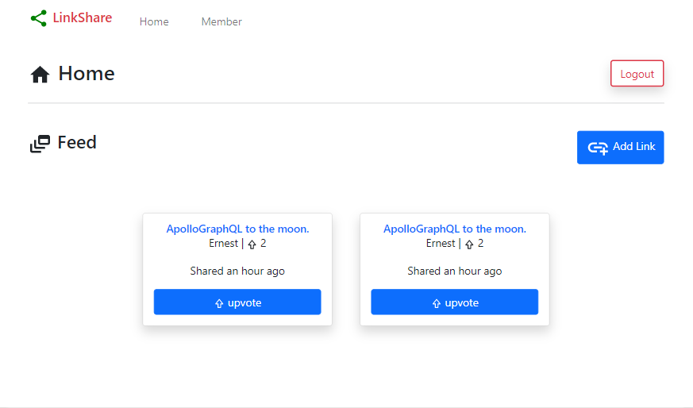

# :confetti_ball: Link Share

A web application built with [Nextjs](https://nextjs.org), [Graphql](https://graphql.org) & [SQLite](https://sqlite.org).



This web app allows registered members to share, edit, upvote & delete links to their favorite websites; other uses can also upvote the links.

## :computer: How to run locally

- Install Nodejs(>=v14).
- Clone/fork the repository.
- Run `npm run install` from the root directory.
- Run `npm run dev` to start the development server.
- Navigate to `http://localhost:3000` from your browser to test app.
- For production server, build and start using `npm run build && npm run start` and navigate to the same address- `http://localhost:3000`.

> :warning: Remember to create `.env.local` file to store authentication token secret key. Like below but make your secret value is _secret_:
>
> ```bash
> SECRET=Aijdbx3309593k2nVd
> ```

## :rocket: Deployment

The web app is currently hosted on [Vercel](https://vercel.com) via: <https://linkshare.up.railway.app>.

## Current & future features

The web app can be improved in so many ways and some includes:

- [x] - Authentication & authorization.
- [x] - Create, delete, update & upvote links shared.
- [ ] - Comments.
